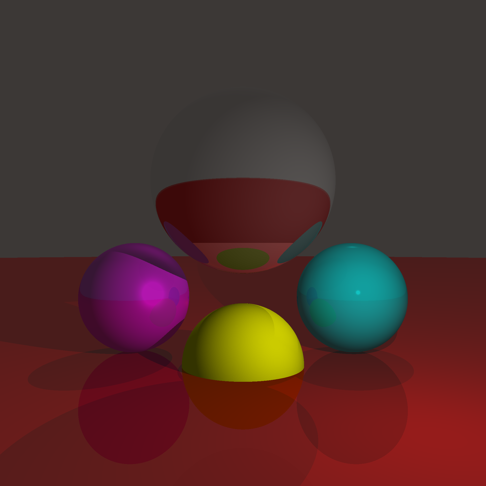

# Rusty Raytracer

>⚠️This project is still under active development. Please be patient as core features are still missing!⚠️

A raytracer written in Rust🦀 from scratch.


## How to use

To try it just clone the repo and build the project using:

```BASH
cargo run --release filename
```

Where `filename` is the name of the `.png` file containing the finished render.

To change the scene, modify the `main.rs` file.

## Features I would like to add

> This is a list of missing features I will maybe add in the future.

- **arbitrary camera rotation**
- **parallelization**
- shadow optimization
- subsampling & supersampling
- **support other primitives**
- **transparency**
- refractions

